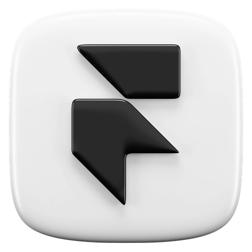
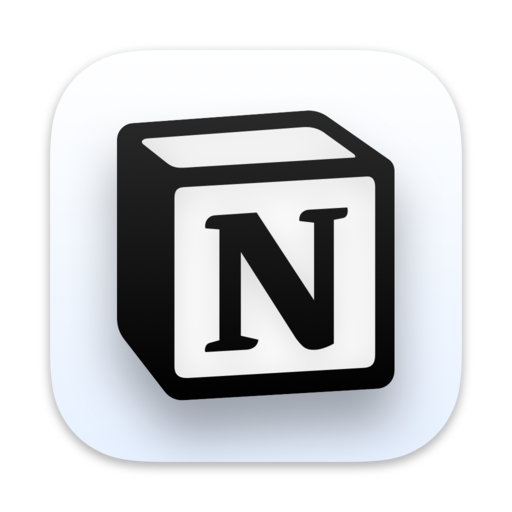

# Hi, I'm Henil Patel 👋

### A passionate indie developer and open sourceror building modern and creative web apps.

## 🚀 Skills

### Languages

  
  
  

### 🍱 Frameworks & Libraries

  
  
  
  

### 💻 Tools

 
  
  
  
  

---

## 🔗 Connect with me

---

## 🖼️ All assets

Here are the PNG assets included in this repository. Each image is referenced with a relative path so it renders on GitHub.

  
  
  
  
  
  
  
  
  
  
  
  
  
  
  
  
  

